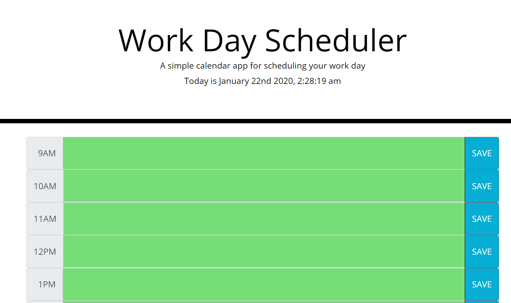

# Flex-That-Schedule

This online daily planner contains hourly slots from 9AM - 5PM, typically for normal businesses. Each time block is color-coded to indicate past, present, and future times, relative to the current time. After the "save" button is clicked, it will store that information for each time block in LocalStorage. Whether the page might be accidentally closed or exited, the information for each time block is saved every time the app is opened.

## Technologies Used
* HTML, Bootstrap/CSS, Moment.js, Javascript, jQuery, LocalStorage

## Links
* https://jamieluong03.github.io/Flex-That-Schedule/
